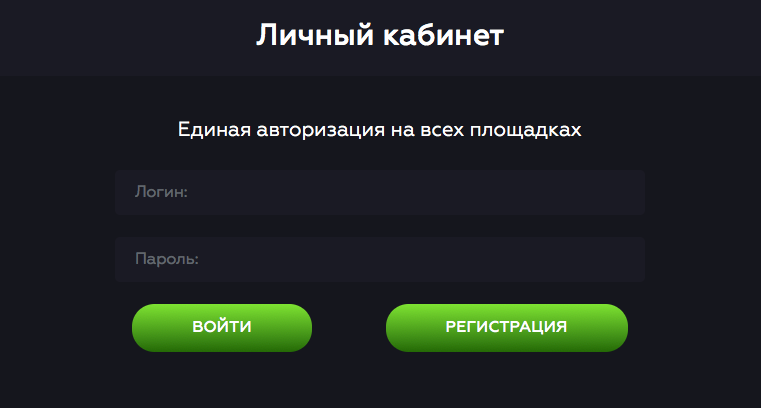

<h1 align="center"> Тестовый сайт для ознакомления с функциями HTML </h1>
<h2 align="center"> 
 

</h2>

> [!NOTE]  
> Данный репозиторий - **некоммерческий** релиз

***
Работа с языком HTML и его функциями, работа со стилями текста, изображений, кнопок, объектов. А также работа со скриптовой части сайта (язык JavaScript).
***

## Преимущества
- [x] Быстрый и удобный сайт
- [x] Собственная база данных
- [x] Бизнес идея

## 

В проекте внедрена собственная база данных, состоящая из .xml файла. С ее помощью присутствует авторизация и регистрация на сайте.

### Решение проблем
- Сайт находится на стадии доработки, поэтому еще не выпущен в мировой хост. Посмотреть функционал можно клонировав репозиторий и запустить сайт через **localhost**
- Как открыть 
    <a href="https://github.com/Flowseal/zapret-discord-youtube/discussions/251">*localhost*</a>
  

- 

    
